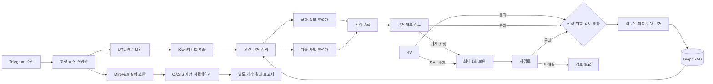

# AI 전략 관측소 · 하루 뉴스

메뉴는 읽기·탐색 / 분석·검토 / 운영으로 통일했습니다. 로컬 전체 메뉴는 15개이며 전략 검토실 안에 11개 하위 화면이 있습니다. 메뉴 변경 내역과 화면별 도구 구분은 [MENU_UX_REVIEW.md](MENU_UX_REVIEW.md)를 참고하세요.

상태 조회는 일시 통신 오류 후 자동 복구하며, 공개 그래프는 필터·표시 한도에 필요한 조각만 읽습니다. 공개 자료 세대는 최대 24시간·데이터 조각 400MiB 범위에서 보존하고 오래 열린 탭은 검색 조건을 유지해 새 판으로 복구합니다. 문서별 전략 투영·관측 소속은 입력/규칙 해시로 증분 재사용합니다. 논문·위키·기사 해설은 별도 background worker가 실행하며 `/api/runtime/workers`에서 로컬 생존 상태를 확인합니다. HTTP 재시작은 이 worker 종료 요청이 아닙니다. 상세 구조와 잔여 성능 비용은 [ARCHITECTURE.md](ARCHITECTURE.md), 검증 범위는 [Plans.md](Plans.md)를 참고하세요.

## 모델 호출 절감

호출 큐는 상세·기본 분석을 위키·논문 작업보다 우선 배정하고, 60초 이상 대기한 작업은 승격합니다. 기존 동시 호출 상한과 대화형·검토 여유를 유지합니다. 단순 논문 공개 안내도 결과 주장·위험 신호가 없는 경우에만 통합 경로 후보가 됩니다.

신규 상세 분석은 단일 일반 기사에 한해 통합 생성 1회와 독립 검토 1회로 처리합니다. 연구·벤치마크·민감 기사와 재시도는 기존 다단계 분석을 유지합니다. 원문·인용·현재 입력 해시·독립 검토 기준은 유지하며 동일 입력/모델/스키마의 검증된 중간 결과를 재사용합니다. 기본 분석의 키워드 인용은 검증된 후보 ID를 코드로 원문에 연결합니다. 상세 2회 호출에는 별도 기본 분석과 후속 재시도가 포함되지 않습니다. 최신 구현·운영 상태는 [Plans.md](Plans.md)의 날짜별 기록을 참고하세요.

## Telegram 정기 수집·기본 분석 스킬

`skills/news-telegram-collect`는 이 프로젝트의 수집·기본 분석 스킬입니다. 개인 스킬 경로 `~/.codex/skills/news-telegram-collect`에도 설치할 수 있으며 `$news-telegram-collect`로 호출합니다. 실제 Telegram 수집기는 기존 감독기에서 약 30초 간격으로 신규 업데이트를 확인합니다.

`scheduled_collection.py`는 최근 수집 확인과 기사 추출 완료 뒤 현재 입력 해시·저장 독립 검토를 대조하고 신규·변경 입력만 기본 분석 대상으로 처리합니다. 기존 유효 결과는 재사용하며 2 workers·1건 묶음을 사용합니다. 시간 초과·DB 잠금·연결·용량 오류로 중단된 run은 실제 엔진 확인 후 같은 체크포인트로 제한적으로 재개합니다. 사용자 중지·검토 실패·사용량 제한·인증·권한·circuit_open은 자동 해제하지 않습니다. 지수 대기, 진척 없는 시도 3회 및 run당 총 20회 상한을 영속 기록합니다. `--check`는 DB 점검, `--status`는 마지막 실행 결과 조회입니다.

`ops/com.hollobit.ai-news.baseline.plist`는 로그인 시와 이후 5분 간격으로 이 점검을 실행합니다. 수집기·기본 분석 owner가 이미 실행 중이면 중복 실행하지 않습니다. 컴퓨터 잠자기 중에는 실행되지 않습니다. 새 설치에서는 `config.example.json`을 `config.json`으로 복사해 채널을 설정하고 기존 환경 설정 안내를 따릅니다.

소스는 `news-app` 브랜치에 보관합니다. 새 체크아웃에서는 `git clone --recurse-submodules --branch news-app https://github.com/hollobit/AI-News.git`로 고정 Agent-Reach 소스도 받습니다. 공개 읽기 전용 사이트는 기존 `gh-pages` 브랜치를 사용합니다.

공개 읽기 전용 사이트: https://hollobit.github.io/AI-News/ . 뉴스·날짜별 아카이브·기본/심층 검토 분석·위험과 조건부 시나리오·논문·위키·출처 목록 및 기존 관측 지도/지식 관계 탐색을 제공합니다. 새 LLM 질문 생성·수집·설정 변경은 로컬 서버 전용입니다. 전체 공개본 생성은 `.venv/bin/python export_wiki_site.py --full-site --output .runtime/public-site`, 배포/동기화는 [PAGES_DEPLOYMENT.md](PAGES_DEPLOYMENT.md)를 참고하세요.

## 리팩토링 후 구조와 운영

`/`·`/strategy`는 최근 변화 읽기, `/operations`는 기본 분석·협업·누적 개선 관리 화면입니다. 기존 `#baseline`, `#workflow`, `#improvement` 직접 링크도 운영 화면으로 표시합니다. 뉴스 조회는 `news_repository.py`, DB 준비는 `database.py`, 서버 조립·종료는 `server_bootstrap.py`, HTTP 계약은 `server_http.py`로 분리했습니다. 읽기 요청은 마이그레이션·분류/키워드 색인 갱신·형태소 캐시 저장을 수행하지 않습니다. 준비되지 않은 색인은 503으로 안내하고 백그라운드에서 준비합니다.

기본 분석은 `baseline_jobs.py`가 원장을 조회하고 `baseline_worker.py`가 별도 프로세스로 처리합니다. 서버 재시작은 worker를 종료하지 않습니다. 중지는 운영 화면/API의 pause 요청으로 기록하고 진행 중 문서의 체크포인트에서 적용합니다. 같은 DB의 worker 잠금과 실제 owner 확인으로 중복 실행을 막습니다. run·검토·재시도 이력은 그대로 유지합니다. 심층/논문 등 다른 작업의 기존 실행 정책은 유지합니다.

분류·전략 점수는 정확한 입력 해시와 규칙 버전별로 `data/news.sqlite3.features.sqlite3`에 저장합니다. 이 파일은 재생성 가능한 계산 캐시이며 분석 검토 원장이 아닙니다. 원문 내용이나 규칙이 바뀌면 재사용하지 않습니다. 형태소의 기존 내용 해시 캐시도 유지합니다.

공개본은 `site-manifest.json`과 내용 해시별 JSON을 사용합니다. 처음에는 작은 뉴스 목록과 현재 표시할 상세만 읽고, 전체 검색 색인은 검색 시, 지도는 최초 범위/선택 주변만 읽습니다. manifest는 한 탭에서 고정하며 직전 데이터 파일도 한 세대 보존합니다. `site.json`·`knowledge.json`은 이전 클라이언트와 완전성 점검을 위해 계속 생성하지만 새 첫 화면은 읽지 않습니다. 게시 파일의 허용 목록과 모듈 의존성 검증은 유지합니다.

검증은 `.venv/bin/python -m pytest tests -q`, `node --test tests/*.test.cjs`를 사용합니다. `tests/ui_refactoring.py`는 실제 공개 생성본의 초기 JSON 2MiB 예산, 전체 그래프 미로딩, 로컬 읽기/운영 화면·모바일·본문 이동을 검사합니다. `npm ci` 후 `npm run format`으로 직접 작성한 정적 자산을 정리하고 `npm run check:format`으로 확인합니다. 포함된 three.js 원본은 제외합니다. GitHub Actions는 프로젝트 테스트·JavaScript·포맷 검사를 실행합니다. 구조 및 식별자/검토 계약은 [ARCHITECTURE.md](ARCHITECTURE.md), 개선 항목별 이행 범위는 [REFACTORING_GUIDE.md](REFACTORING_GUIDE.md)를 참고하세요.

## 뉴스 분석 모델과 위험 갱신

`model_policy.py`는 기본 분석을 `gpt-6-luna`, 일반 위험 분석과 독립 검토를 `gpt-6.1-sol`, 중요한 위험의 검토 및 반복 보완을 `gpt-6-astra`로 고정합니다. 구버전으로 자동 대체하지 않습니다. 유효한 과거 검토 결과는 그대로 재사용하며 새 호출의 모델·역할·입력 해시를 기록합니다.

`.venv/bin/python model_access.py --refresh`로 실제 로그인에서 세 모델의 접근을 확인합니다. 모델명 설정만으로 사용 권한이 생기지 않습니다. 프로젝트 CLI 0.154.0에서는 최신 Luna·Sol이 거절됐지만 0.159.2로 갱신 후 같은 로그인에서 세 모델 모두 동작했습니다. `sh ops/install-analysis-cli.sh`로 검증된 프로젝트 전용 CLI를 설치하고 접근을 점검합니다. CLI 변경 시 과거 접근 실패 캐시를 다시 검사하며, 사전 점검 실패는 새로운 분석 실행을 차단합니다.

`scheduled_risks.py`는 수집 완료 후 심층 위험 분석을 소량씩 이어가는 별도 스케줄러입니다. 최근 기사 우선과 과거 적체 처리 순번을 나누고 사용자 중지·검토 거절·사용량 한도를 보존합니다. 최신 모델 접근이 확인되면 `--enable --resume`으로 기존 cycle을 명시 재개하고 `ops/com.hollobit.ai-news.risks.plist`를 사용자 LaunchAgent로 등록합니다. 기본 분석 완료와 위험 시나리오 갱신 완료는 서로 다릅니다.

## 지식 위키

공개 관계 탐색은 현재 입력·독립 검토를 통과한 뉴스와 논문의 문서별 분석 전체를 연결합니다. 뉴스 문서 수, 종합 위키 페이지 수, 지도 노드 수는 서로 다릅니다. 종합 위키의 검토된 의미 관계와 90일 문서별 공동 관측(탐색 추천)을 구분하며, 전체 분석 연결이 모든 문서의 종합 위키 편찬 완료를 뜻하지는 않습니다. 신규·변경 자료는 다음 공개 스냅샷 생성에서 반영됩니다. 로컬 지식 API는 조회 지연 방지를 위해 종합 위키 범위를 유지합니다.

`service_supervisor.py server|collector|deep`는 기존 프로세스를 중복 실행하지 않는 감독기입니다. 설치된 프로젝트 LaunchAgent가 로그인 후 시작합니다. 서버·수집기는 빠른 실패 3회 후 자동 실행을 멈추고 로그를 남깁니다. 심층은 실행 기록의 소유자만 없어진 경우 복구하며, 사용자 일시중지·검토 대기·완료를 자동 해제하지 않습니다. 모델 오류로 일시중지된 분석의 재개는 별도 점검이 필요합니다.

`/knowledge`는 원자료·주장·주제·대상·개념·사건을 연결한 지식 지도입니다. 로컬에 포함한 three.js로 3D 탐험을 기본 제공하며, 드래그 회전·휠/두 손가락 확대·키보드 방향키·노드 선택과 카메라 위치 URL 복원을 지원합니다. WebGL을 사용할 수 없으면 기존 2D SVG 지도로 전환합니다. 두 보기에서 유형/연결 묶음 색상, 검색, 관계 층 필터, 인접 노드 탐색, 지식 점검을 공유합니다. 관측 지도의 공동 등장 선과 검토된 의미 관계, 단순 탐색 추천은 구분합니다.

`/wiki`에서 임의 주제를 추가하고 검색어·활성화·과거 근거(최대 8개 추가)를 관리합니다. 기존 주제 범위와 합쳐 근거는 최대 24개입니다. GraphRAG의 검토된 질문은 위키 저장 버튼으로 원출처 재검토를 요청할 수 있습니다. `/api/wiki/vault`는 Obsidian 호환 ZIP입니다.

GitHub Pages용 읽기 전용 사이트: `.venv/bin/python export_wiki_site.py`. 기본 생성 위치는 `.runtime/wiki-site`, 원문 발췌·DB·인증 설정은 제외합니다. 로컬 생성만 수행하며 자동 게시하지 않습니다. [공개 범위·배포 안내](PAGES_DEPLOYMENT.md).

`/wiki`에서 의료·공공 AX·소버린 AI를 주제 → 대상·사건·쟁점 → 원근거 순서로 탐색합니다. 새 뉴스가 들어오면 관련 주제의 종합 설명을 갱신하고, 주장과 관계의 독립 검토를 통과한 판만 공개합니다. 원문이 바뀌거나 삭제되면 이전 설명은 현재 페이지에서 제외되고 재검토 대상으로 표시됩니다.

- 기존 외부 분석 활성화 설정을 따르며, 서버가 10분 대기 주기로 입력 변경을 확인합니다. 생성·검토 소요 시간은 별도입니다. 변경 없는 완료 판은 재생성하지 않습니다.
- 최근 일치 뉴스 최대 12개·검토 논문 초록 최대 3개와 이전의 유효 근거를 합쳐 최대 24개로 종합합니다. 전체 뉴스 전수 위키화가 아닙니다.
- 주제·대상·사건·쟁점 페이지, 인용 발췌, 관계 설명, 갱신 이력과 설명 추가·제외 기록을 제공합니다. 미검토 초안은 공개하지 않습니다.
- 기사 해설의 **이 기사를 연결한 지식 위키** 링크는 해당 원출처를 실제 인용한 페이지로 연결합니다. 연결이 없으면 빈 목록이며, 관계를 추측해 만들지 않습니다.
- GraphRAG는 현재 위키의 설명을 참고하되 원출처로 다시 대조하고 인용합니다. 위키를 별도의 독립 증거로 세지 않으며 기존 선택 범위를 확대하지 않습니다.
- 기존 관측 지도는 공동 관측, 위키는 검토된 의미 관계입니다. 양쪽의 관계를 혼용하지 않습니다.

API: `GET /api/wiki?id=medical`, `GET /api/wiki?source_url=…`, `POST /api/wiki {"topic":"medical"}`. 저장·공개·재검토 규칙과 초기 범위는 [WIKI_SCHEMA.md](WIKI_SCHEMA.md)를 참고하세요.

관측 지도(`/observatory`)의 **더 많은 노드 보기**를 누르면 기본 주제 36·키워드 48·관계 180개 상한을 주제 72·키워드 96·관계 360개까지 확장합니다. 선택 기간의 실제 근거가 있는 후보만 표시하며, 기본 범위로 복귀할 수 있습니다. 집계 중에는 기존 자료가 유지됩니다.

Hermes agent가 텔레그램 채널에 보낸 메시지를 개별 뉴스로 나누고 날짜·주제·콘텐츠 유형별로 모아 읽는 개인용 뉴스 페이지입니다. 여러 날짜의 반복 링크는 링크별 분석 화면에서 함께 볼 수 있습니다. 기본 수집·분류에는 Python 3.10 이상만 필요합니다. 전략 화면의 형태소 분석에는 별도의 Kiwi 패키지가 필요합니다. 외부 의미 분석은 별도 활성화와 로그인된 Codex CLI가 필요합니다.


## 2026-09-16 외부 자료·수집 집계·관측 신호 보완

- `/sources`: Agent-Reach 1.5.0을 프로젝트 전용 환경에 연결했습니다. 공개 웹/X/GitHub/YouTube/RSS 읽기 작업과 결과를 확인합니다. 추가 도구·로그인이 필요한 플랫폼은 설정 필요 상태로 표시합니다. 원문 읽기는 기존 source_excerpts 캐시와 GraphRAG의 **미검토 원문 근거**에 연결됩니다. 상세 설치·범위는 [통합 설명](integrations/agent-reach/README.md)을 참고하세요.
- Telegram은 **신규 메시지 확인 → 저장·뉴스 분리 → 중복 제거 → 고유 수 갱신** 순서로 기록합니다. 수집기 확인 시각, 메시지 수신/저장 시각, 추출 완료 시각이 다릅니다. 실제 고유 수와 기본 분석 실행의 고정 대상 수를 따로 표시합니다. 점검 시점6278건과 이전 분석 대상6175건의 차이는103건이었습니다. 새 자료의 분석 완료를 뜻하지 않습니다.
- 전략 카드·선택 탭은 현재·직전 기간 모두 자료가 있는 주제만 표시합니다. 등록 설정은 보존합니다. AI 통제 신호는 같은 문장의 AI 문맥과 정확한 수집 문장을 확인하고, 현재7일의 건수·인용과 직전7일 비교를 표시합니다. 근거 없는 관측 카드는 숨기고, 제안·부정·조건부 표현 및 Telegram/원문 출처를 구분합니다. 실제 통제 효과의 LLM 검증으로 표시하지 않습니다.
- 영상 기반 시각화는 [구현 제안](VISUALIZATION_PROPOSAL.md)에 화면 구성·데이터 연결·구현 순서·검증 기준을 정리했습니다. 3D 화면 자체는 아직 구현하지 않았습니다.

## 2026-09-16 복구·GraphRAG·주제 강조

`근거로 읽는 기술 동향`에서 전략 주제를 선택하면 선택 버튼·카드와 뉴스 제목·요약·상세의 일치 표현을 강조합니다. `전체 전략 주제`로 돌아가면 표현 강조도 해제됩니다.

GraphRAG는 원문 관련도, 한국어 조사·등록 한영 별칭, 중복 문서 제외를 적용하고 인용 원문의 의미를 별도 검토합니다. 검토가 완결된 동일 질문·동일 근거 답변을 최대 10분 재사용하며, 원문·검색 결과가 바뀌면 새 답변을 생성합니다. 전략 화면과 그래프 화면 모두 주장별 근거를 열 수 있습니다. 엔진 오류는 원인 코드로 기록하고, 반복 실패는 체크포인트를 보존한 채 중지합니다.

요청한 기본 분석 미완료 26건은 기존 동결 실행에서 모두 검토를 통과했습니다. 심층 분석 실패·검토 대기는 계속 재처리 중이며 전수 완료 상태가 아닙니다. 실제 속도·품질 측정과 남은 한계는 [GRAPHRAG_REVIEW.md](GRAPHRAG_REVIEW.md)를 참고하세요.

## 전략 검토와 결정: `/intelligence`

뉴스 탐색에서 **원문 버전 → 검토 주장 → 사건 → 주제 → 선택지·조건부 시나리오**로 이어지는 별도 작업 공간입니다.

| 메뉴 | 내용 |
|---|---|
| `/intelligence` | 중요한 변화와 재검토할 결정 |
| `/intelligence/events`, `/intelligence/topics` | 사건·주제 목록, 근거·주장·버전 이력, 사건 병합·분리와 출처 귀속 |
| `/intelligence/concepts` | 공통 개념의 한국어·영어·중국어 별칭, 원문 표현, 수동 분리·제외 |
| `/intelligence/decisions` | 선택지·비용·전제·반대 근거·선택 이유·담당자·재검토일 |
| `/intelligence/scenarios` | 명시 가정·관측 조건, 독립 검토를 거치는 비교, MiroFish 초안 연결 |
| `/intelligence/research` | 논문 발표부터 재현·실증·도입·조달·표준까지 별도 근거 연결 |
| `/intelligence/profiles` | 중요도·위험·근거 충족도·기회 가중치 프로필 |
| `/intelligence/experiments`, `/intelligence/operations` | 고정 근거의 규칙 비교·승격·롤백, 검토 사유별 보완 |
| `/intelligence/risk_history` | 위험 평가 변경과 재검토 이력 |

새 저장소는 `intel_` 접두어를 사용합니다. 명시 원문 URL이 없는 기사도 수집 원장과 같은 내용 식별자로 보존하며 Telegram 메시지 URL 때문에 서로 다른 기사를 합치지 않습니다. 원문 변경·철회는 관련 주장·사건·주제를 재검토 대상으로 만들고 이전 버전을 남깁니다. 보고량·정부 언급·에이전트 합의는 독립적인 사실 확인 수가 아닙니다.

주제 상세의 7·28·90일 모멘텀은 URL·사건 후보·원출처를 구분합니다. 낮은 표본, 관측 공백, 채널 범위 변화가 있으면 증가율 변화의 해석을 제한합니다. 기사 발행일, Telegram 게시일, 명시 수집시각은 분리합니다. 중요도와 근거 충족도는 별개이며 알 수 없는 위험은 0점 대신 미상·범위로 유지합니다. 여러 문서의 중요도·근거 충족도는 평균, 기회는 검토된 기회 문서 평균, 위험은 최고 수준으로 집계하며 미평가 위험을 유지합니다.

### 전략 검토 API

- `GET /api/intelligence?view=overview`: 개요. `view=events|topics|concepts|documents|claims`는 목록이며 `id`를 주면 상세를 반환합니다.
- `GET /api/intelligence?view=decisions|scenarios|profiles|research|experiments|operations|risk_history`: 해당 자료·운영 화면.
- `GET /api/intelligence?view=momentum|coverage`: 기간별 관측과 확보 범위.
- `POST /api/intelligence/events`: `action=merge|split|source`, 변경 사유와 대상 ID.
- `POST /api/intelligence/concepts`: `action=alias|split|exclude`, 명시 별칭·언어 또는 제외 상태와 사유.
- `POST /api/intelligence/decisions`, `/scenarios`, `/profiles`, `/research`: 결정·시나리오·평가 프로필·연구 근거 기록. 시나리오의 `compare`는 외부 분석, `draft`는 MiroFish 초안입니다.
- `POST /api/intelligence/query`: 질문과 `mode=local|global|hybrid`로 현재 검토 자료의 제한된 종합을 요청합니다.
- `POST /api/intelligence/experiments`: 후보 기록, 고정 자료 실험, 통과 결과의 명시 승격·롤백.
- `GET /api/intelligence?view=job&id=...`: 비교·질의 작업 상태와 결과.

목록은 `page`, `page_size`, 검색 `q` 등을 사용합니다. 외부 모델 작업에는 기존 분석 활성화·인증이 필요합니다. 화면 준비와 근거 동기화는 백그라운드에서 수행하며 원문·검토 결과가 바뀌면 관련 결정에 재검토 상태를 붙입니다.

**운영 한계:** 기능 구현은 전수 심층 분석의 완료와 다릅니다. arXiv의 HTTP 429 대기·실패는 확보된 메타데이터로 표시하지 않습니다. MiroFish 전체 엔진은 Zep 키 등 설정이 필요하며 초안 생성을 실제 시뮬레이션 완료로 간주하지 않습니다. 논문 초록·부분 기사 분석의 범위도 유지합니다. 구현 범위와 검증 기준은 [STRATEGY_ROADMAP.md](STRATEGY_ROADMAP.md)에 정리했습니다.

### 통합 검증 결과 (2026-09-15)

- Python 전체 테스트 **451개 및 하위 사례 56개 통과**(11.43초). JavaScript 구문 검사와 기본 데이터 표시 동작 6개도 통과했습니다.
- 실제 사건·역할·위험 분석은 기사 날짜를 사건 날짜로 혼동한 문제를 독립 감사가 발견해 한 차례 보완한 뒤 검토를 통과했습니다. 실행 시간은 약 205초였습니다.
- 실제 전략 질의와 시나리오 비교 2건은 독립 검토를 통과했습니다. 두 사례의 규칙 비교 실험은 품질이 동률이고 더 느려 거절됐으며 승격하지 않았습니다.
- 브라우저 11개 화면에서 JavaScript·API 오류가 없었고, 너비 390px에서 가로 넘침이 없었습니다. MiroFish는 초안 생성까지 확인했습니다.

기본 데이터 안내는 내용이 같은 상태로 재방문하면 접히고, 실제 내용이 갱신되면 자동으로 펼쳐집니다. 진행 시각만 바뀌었다고 같은 설명을 반복해서 펼치지 않습니다. 운영 서버에는 새 코드를 반영했으며 초기 전략 자료 준비는 런타임 상태로 확인할 수 있습니다. 위 검증은 전수 심층 분석 완료나 미확보 외부 원문 확보를 의미하지 않습니다.

## 전략 분석 워크스페이스

기본 `/`와 `/strategy`는 AI 전략 관측소입니다. 기존 날짜별 보기는 `/news`와 기존 `/?date=...` 링크에서 이용할 수 있습니다.

- **전략 주제**: 중국, 미국, 소버린 AI, Physical AI, Agentic AI, AI 인프라, 오픈 모델. 주제 버튼으로 근거 뉴스를 좁히고 사용자 관심 검색어·동의어를 브라우저에 저장합니다. 회사명은 국가별 탐색 단서이며 국가 귀속이나 공식 정부 입장을 판정한 값이 아닙니다.
- **주제 선택 반응**: 주제 버튼을 누르면 선택 표시와 로딩 안내가 즉시 바뀝니다. 같은 주제를 다시 눌러도 선택이 유지되고, `전체 전략 주제`는 주제·관심 키워드 선택을 해제합니다. 검색·날짜·분야 조건까지 해제하려면 `필터 초기화`를 사용합니다. 조회가 30초를 넘기거나 실패하면 현재 위치에서 다시 시도할 수 있습니다.
- **성장 추이**: 최신 뉴스 날짜를 끝으로 최근 7일과 직전 7일을 비교합니다. 각 기간 내 동일 정규 URL을 1문서로 집계하고 전체 문서 수 대비 비중 변화(pp)를 계산합니다. 늦은 수집과 채널 편집에 민감하므로 시장 성장률과 구분합니다.
- **전략 키워드**: Kiwi가 한국어 명사·고유명사와 원문에서 연속한 명사구를 추출합니다. 기술용어 사전으로 `소버린 AI`, `Physical AI`, `강화학습`, `수출통제` 등 복합어와 별칭을 통합하고, 모델 버전명과 원문 위치·품사를 보존합니다. URL 조각, 조사·어미, 일반적인 서술어는 전략 후보에서 제외합니다. 전체 단어 검색 색인은 별도로 보존합니다. 외국어는 등록 기술용어·식별자 중심이며 전 언어의 완전한 형태소 분석을 주장하지 않습니다.
- **국가·정부 가중치**: 전략 점수 = 비중 변화(pp) × `(1 + 0.35×국가 언급 문서 비율 + 0.35×정부·정책 언급 문서 비율 + 고유 문서 평균 분야점수/100)`. 최대 2.30배이며 후보 우선순위에만 적용합니다. 원래 등장 건수·성장률·비중은 변경하지 않습니다. 실제 근거 수와 가중치가 표시됩니다.
- **신규 후보**: 최근 3개 이상 고유 문서, 2일 이상 등장, 비중 상승 조건을 적용합니다. 비교 기간에 없었다는 의미이며 세계 최초 용어나 확정된 신산업으로 표시하지 않습니다. 의미적으로 새로 제안한 전략 개념은 협업 분석의 검토 결과에서 구분합니다.

### 실행 환경

```sh
# Python 3.12 권장. 이미 준비된 이 환경에서는 아래 activate부터 실행합니다.
python3.12 -m venv .venv
.venv/bin/python -m pip install -r requirements.txt
.venv/bin/python app.py serve --port 8001
# 별도 터미널
.venv/bin/python app.py collect
```

이 작업 환경의 Python은 `.runtime/python`에, 뉴스 앱 환경은 `.venv`에, MiroFish 환경은 `.runtime/mirofish/venv`에 분리되어 있습니다. 원문 재조회·키워드 추출은 로컬에서 처리하며 LLM 분석은 기존 활성화 설정과 로그인된 CLI를 사용합니다. 전역 CLI 실행 파일이 없으면 `.runtime/codex`의 공식 CLI 설치를 우선 사용합니다.

### 짧은 원문 정보 보강

`원문 정보 보강`은 현재 필터의 최신 URL 최대 40개를 조회합니다. 단일 뉴스에서도 원문 정보를 요청할 수 있습니다. `POST /api/sources`는 현재 수집 기록에 있는 URL만 받으며, 일괄 상한은 100개·병렬 조회는 4개입니다. 조회 화면을 열기만 해서는 외부 사이트를 요청하지 않습니다.

`source_excerpts`에 제목·부분 본문 최대 3,500자·최종 URL·조회 시각·상태·내용 해시를 저장합니다. 성공은 7일, 실패는 1시간 캐시하며 종합 분석·링크 의미 분석·빠른 관계 분석·키워드 추출에서 재사용합니다. 재조회되면 파생 색인을 갱신하고 해당 링크 분석을 갱신 필요로 표시합니다. 메시지 원문과 원문 조회 결과는 별도로 표시합니다. 공개 IP·리디렉션·응답 크기 제한은 기존 `source_content.py`를 공유합니다.

### 다중 역할 분석·검증 사이클

`분석 사이클 실행`은 현재 필터에서 선택된 뉴스 최대 8개를 입력으로 사용합니다(API 상한 24개). 실제 단계는 다음과 같습니다.

1. 수집 기록 스냅샷과 URL 중복 정리
2. 원문 발췌 수집 및 실패·조회 시각 기록
3. Kiwi 형태소·기술 키워드 추출
4. 기존 GraphRAG에서 관련 관계·근거 검색
5. **국가·정부 전략 분석가**와 **기술·사업 전략 분석가**의 병렬 분석
6. 전략 종합 및 별도 역할의 근거 대조 검토
7. 거절·지적이 있으면 실패한 기존 URL만 **최대 1회** 캐시를 갱신해 재조회하고, 추가 원문 키워드를 분석한 뒤 **최대 1회** 전략 보완·재검토
8. 검토 통과는 완료, 해결하지 못한 지적은 `검토 필요`로 보존



단계·이벤트·중간 산출물·원문 스냅샷은 SQLite `strategic_workflow_*` 테이블에 저장됩니다. 실패·중단은 재개할 수 있으며 한 서비스에서 한 사이클만 실행합니다. 외부 모델이 맡는 역할들은 동일한 인증된 서비스의 별도 요청이며 서로 다른 모델·기관의 독립 검증을 뜻하지 않습니다. 원문 존재와 주장 뒷받침을 대조하는 절차이지 기사의 진실성을 보증하는 기능은 아닙니다.

MiroFish 원본 `backend/app/services/report_agent.py`의 **도구 실행 → 실제 observation 반영 → 다음 판단** ReACT 흐름을 참조했습니다. 이 앱의 순환은 원문 관찰·검색·분석·검토·한 차례 보완으로 제한합니다. MiroFish OASIS의 가상 사회 시뮬레이션 실행과는 별도의 기능입니다.

원문 복구는 검토 거절과 원문 조회 실패가 함께 있을 때만 실행합니다. 스냅샷에 이미 포함된 실패 URL을 `refresh=True`로 재조회하며 성공 URL이나 새 외부 URL을 추가 탐색하지 않습니다. 새 발췌는 실제 근거로 저장하고 최종 검토 해시도 갱신합니다. 기존 GraphRAG 검색은 해석 단서로 재사용하며 새 원문을 독립된 관측으로 대조합니다.

검토를 통과한 결과만 GraphRAG에 `StrategicClaim → SourceDocument` **근거 인용** 관계로 연결합니다. 보고서·원문 해시 일치와 모든 인용의 대조 여부를 검사합니다. 이 관계는 전략 해석의 출처 연결이며 실제 국가·기업 간 인과관계를 뜻하지 않습니다. 기존 GraphRAG 해석은 새 분석의 검색 단서로만 사용하고, 가상 에이전트 발언은 뉴스 사실 근거로 자동 편입하지 않습니다.

조회·실행 API: `GET/POST /api/workflows`, `GET /api/workflows/{id}`, `POST /api/workflows/{id}/resume`.

### 고영향 분야와 AI 통제 동향 모니터링

국가경제·국가안보·산업·수출·사회문제·생활·교육의 명시적 단서를 전략 검토 우선순위에 반영합니다. 키워드 전략 점수는 비중 변화에 국가 언급 비율, 정부·정책 언급 비율, 분야 점수를 적용하며 가중치 상한은 **2.30배**입니다. 등장 건수·성장률·비중 변화 자체는 원래 관측값을 유지합니다. 높은 점수는 검토 우선순위이며 사실성, 영향 규모 또는 인과관계의 확정을 뜻하지 않습니다. 분석가는 영향 대상·관련 결정·실현 조건·피해와 기회를 근거와 함께 설명해야 합니다.

AI 통제 모니터링은 다음 행위를 구분합니다.

- **Kill switch / shutdown**: 실행 중인 AI 시스템을 정지하는 장치나 조치
- **Training pause**: 새 학습 실행의 일시 중단
- **Training slowdown**: 정책·안전 목적의 모델 학습 진행속도 조절
- **Compute limits**: 모델 학습에 사용하는 연산 자원의 상한
- **Deployment suspension**: 모델·서비스 배포 또는 운영 허가의 중단

상시 5개 주제의 판별 규칙은 유지하며, `trends.monitoring.topics`에서는 고정 주제와 자동 발견 신호를 통제 대상·행동이 비슷한 묶음으로 통합합니다. 현재 7일에 근거가 있는 묶음만 표시하며, 건수는 구성 항목의 합계가 아니라 기간별 고유 문서 합집합입니다. 카드에 최근 14일 일별 추이와 직전 7일 대비 증감을 표시하고, 펼치면 구성 항목의 출처(고정·자동·직접 등록)와 개별 추이·일별 건수를 확인할 수 있습니다. 직전 0건이면 증감률을 계산하지 않습니다. 추이는 현재 규칙으로 보관 뉴스를 재집계한 결과이며 과거 선정 이력을 뜻하지 않습니다. 묶음의 뉴스 보기는 구성 항목의 원래 문장 판별 기준과 제외 설정을 그대로 적용합니다. 연관 키워드는 14일 내 서로 다른 정규 URL 문서 2개 이상에서 실제 공동출현한 Kiwi 명사구·고유명사·기술용어만 제시하고, 근거 제목·URL을 연결합니다. 공동출현은 인과관계나 동의어 판정이 아닙니다. 날짜·주제에 더해 `impact`(7개 영향 분야)와 `sort`(`strategic`/`latest`) 필터를 화면과 원문 보강·연구·역할분석·시뮬레이션 초안에 동일하게 적용합니다. 전략 화면의 기본 정렬은 검토 우선점수 순입니다. 학습률(`learning rate`)이나 학습 처리량 최적화는 정책적 AI 개발 속도 제한과 구분합니다. 분석에서 새 전략 개념을 제안할 때에는 원문에서 **관측**한 용어·동향인지, 근거를 바탕으로 **제안**한 모니터링 개념인지 표시합니다. 기간별 뉴스 출현과 비중 변화는 관측 표본의 변화이며 실제 규제 시행·시장 채택·사회적 확산을 직접 측정하지 않습니다.

### MiroFish 실행 초안

전략 화면에서 현재 필터와 정렬의 우선 20개 뉴스와 가설로 2라운드 실행 초안을 만들 수 있습니다. 초안 생성은 외부 시뮬레이션을 시작하지 않으며, `/simulation`에서 검토 후 실행합니다. 실제 엔진에는 별도 LLM API와 Zep 설정이 필요합니다. 설치 성공, 오프라인 테스트, 뉴스 협업 분석 완료를 실제 OASIS 실행 완료로 표시하지 않습니다.

### 검증

```sh
.venv/bin/python -m pip install -r requirements-dev.txt
.venv/bin/python -m pytest tests -q
node --check static/strategy.js
```

## 샘플로 실행

```sh
python3 app.py demo --db data/demo.sqlite3
python3 app.py serve --db data/demo.sqlite3
```

http://127.0.0.1:8000 에서 확인합니다. 샘플 생성은 처음 한 번만 실행하세요. 샘플은 실제 뉴스와 혼동하지 않도록 화면에 표시하며 실제 수집 DB와 분리합니다.

## 실제 채널 연결

현재 대상은 **hollobit_news (`-1004402623886`)**이며 `config.json`에 저장되어 있습니다. 봇 토큰과 채널 접근 권한이 있어야 실제 연결할 수 있습니다.

이 작업 환경에는 수집 봇 토큰을 로컬 `.env`에 설정했습니다. 재시작할 때는 `python3 app.py collect`를 실행하면 됩니다. `.env`는 Git에서 제외되며 소유자만 읽고 쓸 수 있도록 저장했습니다.

1. Telegram의 BotFather에서 수집 전용 봇을 만듭니다. Hermes 발송 봇과 별도의 봇을 사용하세요.
2. 직접 관리하는 대상 채널에 수집 봇을 관리자로 추가합니다. 메시지를 보내거나 삭제할 권한은 이 앱에서 사용하지 않습니다.
3. `hollobit_news`의 채널 ID는 이미 설정되어 있습니다. 다른 채널을 추가하려면 `config.json`의 `channels` 목록에 `id`와 `name`을 추가합니다.
4. 터미널에서 환경변수를 설정합니다. 토큰을 저장소나 채팅에 붙여 넣지 마세요. 아래 zsh 명령은 입력을 숨기고 토큰이 셸 명령 기록에 남지 않게 합니다.

```sh
read -s 'TELEGRAM_BOT_TOKEN?수집 봇 토큰: '
export TELEGRAM_BOT_TOKEN
python3 app.py collect
```

임시로 대상을 바꾸려면 `TELEGRAM_CHANNEL_IDS` 환경변수에 ID를 쉼표로 구분해 지정합니다. 이 변수는 파일 설정보다 우선하며, 다시 파일 설정을 쓰려면 `unset TELEGRAM_CHANNEL_IDS`를 실행합니다. 허용한 채널만 저장하며 개인 대화나 그룹은 저장하지 않습니다. 수집 프로세스는 한 개만 실행하세요. 기존 webhook이 설정된 봇에서는 polling이 동작하지 않으므로 수집 전용 봇을 권장합니다. 이 앱은 기존 webhook을 변경하지 않습니다.

다른 터미널에서 페이지를 실행합니다.

```sh
python3 app.py serve
```

두 프로세스를 계속 실행하면 새 메시지가 DB에 저장되고 날짜별 페이지에 반영됩니다. 열어 둔 화면에서는 새로고침 버튼으로 새 메시지를 확인합니다. 수집과 화면 서버는 같은 기본 DB인 `data/news.sqlite3`를 사용합니다. 날짜 링크는 `/?date=2026-09-12` 형태입니다. 컴퓨터가 꺼져 있는 동안은 수집되지 않습니다.

## 핵심 소식 중심의 첫 화면

첫 화면은 전체 핵심 소식 → 주제별 핵심 뉴스 → 전체 뉴스 순서로 보여줍니다. 주제별 핵심 뉴스는 상단에 선정되지 않은 소식을 우선 소개합니다. 기사 제목을 누르면 원문이 열리며, 별도의 원문 열기 및 Telegram 원문 링크는 뉴스 화면에 표시하지 않습니다. 날짜·주제·콘텐츠 유형·검색 필터가 함께 적용되며 전체 뉴스는 아래에 항상 펼쳐 표시합니다. 상단 바로가기로 이동하거나 모든 날짜·주제를 선택해 전체 기록을 볼 수 있습니다. 핵심 브리핑 요청이 실패해도 전체 뉴스 목록은 표시합니다.

- 설명 변화·구체성·주제 균형에 기반한 자동 선정이며, 반복 게시 횟수를 중요도 점수로 사용하지 않습니다. 카드에 선정 이유를 표시합니다.
- 같은 링크의 반복과 설명 갱신을 구분합니다. 설명 갱신이 실제 사건의 후속 진행을 확인한 것은 아닙니다.
- 관련 뉴스는 기사 아래 전체 폭으로 표시하며, 다른 URL의 뉴스 제목과 실제 공통 키워드를 함께 보여줍니다. 동일 URL 이력과 동일 제목의 미러 링크는 제외합니다. 키워드 일치에 기반한 후보이며 인과관계 판정은 아닙니다. 반복 이력은 링크 분석에서 별도로 확인할 수 있습니다.
- 현재 메시지·원문 발췌와 일치하는 저장된 의미 분석이 있으면 요약에 활용하고, 없으면 메시지 발췌를 사용합니다. 첫 화면을 열 때 외부 분석을 자동 요청하지 않습니다.

## 단어로 이어 읽기

각 뉴스에는 대표 키워드와 **전체 단어 보기**가 있습니다. 전체 단어 보기를 열면 해당 뉴스의 수집된 제목·본문에 등장한 단어를 검색하고 선택할 수 있습니다. 한글·외국어·일반어·숫자·한 글자 단어도 색인에 남기며, 원문은 그대로 보존합니다. 대소문자와 Unicode 표기 차이를 정규화한 단어 단위 연결입니다. 형태소 분석이나 모든 단어의 의미가 같은지 판정하는 기능은 아닙니다.

- 단어를 누르면 전체 날짜에서 해당 단어가 있는 뉴스로 이동합니다. 다른 키워드를 이어 선택해 탐색을 넓힐 수 있습니다.
- 같은 뉴스에 함께 등장한 단어를 연결하며, 동일한 정규 URL의 재게시를 여러 독립 문서로 세지 않습니다. 동시 등장은 인과관계나 의미적 동등성을 증명하지 않습니다.
- 기본 화면에는 대표 키워드를 표시하고, 전체 단어 목록은 요청할 때 불러옵니다. 단어를 화면에서 생략하는 것과 색인에서 제외하는 것을 구분합니다.
- 최초 뉴스 날짜와 최초 수집 시각을 별도로 보존합니다. ‘첫 등장’은 수집 기록 안에서의 최초 등장이지 세계 최초 발표를 뜻하지 않습니다.
- 새 메시지와 수정 내용이 수집되면 로컬 색인을 갱신합니다. 열린 화면의 새로고침 버튼으로 최신 단어와 연결을 확인할 수 있습니다.
- 단어 색인은 로컬에서 동작합니다. MiroFish의 사회 시뮬레이션을 실행하거나 외부 뉴스 사이트를 자동 탐색하는 기능은 아닙니다.

## 동작과 현재 범위

- 뉴스 날짜별·주제별 보기, 전체 날짜에서 주제 모아보기, 검색, 채널 필터, 본문 펼치기, 기사 링크와 텔레그램 원문 링크.
- 뉴스 기사·논문 소개·블로그 및 해설·소셜 게시물·도구 및 프로젝트·기타 유형으로 구분합니다. 출처 도메인과 URL 경로에 근거한 분류이며, 문서 내용을 직접 확인한 결과는 아닙니다. 논문을 소개하는 블로그 링크는 블로그로, 함께 연결된 arXiv 링크는 논문으로 각각 분류합니다.
- Hermes 메시지의 목록을 개별 뉴스로 분리합니다. 날짜는 개별 항목에 명시된 날짜, 메시지 상단 브리핑 날짜, 텔레그램 발행 날짜(한국 시간) 순으로 적용하며 화면에 근거를 표시합니다. 이는 원문에 적힌 날짜이며 기사 사이트에서 검증한 발행일이 아닙니다.
- 연도가 없는 날짜는 같은 메시지의 명시된 연도 문맥이 있을 때만 해석합니다. 다른 메시지의 날짜를 가져와 붙이지 않습니다. 분리하기 어려운 메시지는 원문 묶음으로 남습니다.
- 주제는 본문 키워드와 브리핑 문맥을 이용해 에이전트·개발, AI 모델, 로봇·자율주행, 의료·바이오, 반도체·인프라, 정책·보안, 기업·산업, 연구·논문, 기타 뉴스로 자동 분류합니다. 하나의 대표 주제를 붙이는 규칙 기반 분류이므로 모호한 항목은 오분류될 수 있습니다. 링크 의미 분석은 아래 별도 기능이며, 메시지 발췌에 근거합니다. 기사 본문 조회는 종합 분석에서 수행합니다.
- 같은 채널에서 본문이 동일한 메시지는 게시 날짜와 ID가 달라도 최초 게시본만 목록·링크 집계·분석에 사용합니다. 공백과 줄바꿈 차이는 무시하지만 본문 날짜·수치·표현 변화는 유지합니다. 원본을 삭제하지 않으며 수정·삭제가 수신되면 대표 메시지를 다시 선택합니다. 서로 다른 채널의 메시지는 별도로 유지합니다.
- 같은 날짜의 동일한 기사 설명은 하나로 표시하고 텔레그램 출처를 모두 유지합니다. 링크가 같아도 설명이 바뀐 기사는 유지합니다. 원문 메시지는 채널 ID와 메시지 ID별로 각각 보존하며 수정 수신 시 개별 뉴스도 다시 분류합니다.
- 텍스트와 미디어 캡션을 저장합니다. 이미지·파일 자체, 텍스트 없는 미디어, rich_message 전용 본문은 현재 처리하지 않습니다.
- 연결 후 전달되는 새 메시지를 수집합니다. 과거 채널 기록을 가져오는 기능은 없습니다. Telegram은 미수신 업데이트를 최대 24시간 보관하므로 장시간 중단 시 누락될 수 있습니다.
- 일반 채널 메시지 삭제는 자동 동기화하지 않습니다. 비공개 원문 링크는 해당 채널에 접근할 수 있는 계정에서 열어야 합니다.
- 로컬 개인용 서버입니다. 로그인, 인터넷 배포, 매일 정해진 시각의 완결된 요약 발행은 아직 포함하지 않습니다. 매일의 페이지는 메시지가 들어올 때 바로 구성됩니다.
- 토큰은 브라우저에 전달되지 않습니다. 시작 시 프로젝트 `.env`에서 `TELEGRAM_BOT_TOKEN`, `TELEGRAM_CHANNEL_IDS`, `SSL_CERT_FILE`, `NEWS_EXTERNAL_ANALYSIS_ENABLED`만 읽으며 기존 환경변수가 우선합니다. 파일은 따옴표 없는 `KEY=value` 형식이며 셸 명령이나 변수 확장을 실행하지 않습니다. 이 Mac에서는 Python 인증서 오류를 해결하기 위해 설치된 CA 묶음 경로를 `SSL_CERT_FILE`에 설정했습니다. 다른 환경에서는 해당 경로를 그대로 복사하지 마세요. DB에는 메시지 원문이 저장됩니다.

## 링크별 분석

`/?view=links&date=all`에서 링크 그룹을 봅니다. 날짜·주제·콘텐츠 유형 필터와 여러 날짜에 등장한 링크만 보는 필터를 함께 사용할 수 있습니다.

- 항목에 포함된 모든 HTTP(S) 링크를 추출합니다. 추적용 쿼리 파라미터, Reddit 게시물 제목 차이, X/Twitter 주소, arXiv 초록/PDF/버전 표기 등 식별 가능한 변형을 정규화합니다. 버전별 원래 URL은 유지합니다.
- 같은 링크의 날짜별 언급과 텔레그램 출처를 보존합니다. 최초·최근 날짜는 수집 내용에 표시된 날짜 기준이며, 실제 기사 발행일을 검증한 값이 아닙니다.
- 서로 다른 링크는 제목의 핵심 용어가 겹치는 경우 관련 후보로 연결합니다. 같은 기사라고 자동 병합하지 않습니다. 제목 표현이 다르면 관련 후보를 찾지 못할 수 있습니다.
- 메시지 분리 과정에서 기사에 연결되지 않은 원문 URL도 링크 목록에 보존합니다. 문맥이 불확실한 조각은 그 사실을 표시합니다.
- 로컬 표현 비교는 동일한 설명의 반복과 새로 등장한 표현을 구분합니다. 동의어를 이해하는 의미 분석이나 새로운 사건이 일어났다는 판정이 아닙니다.
- 상세 의미 분석은 핵심 주장, 의미와 전제, 날짜별 설명의 변화, 추가 확인 사항을 생성하고 각 분석 항목을 근거 메시지에 연결하도록 구현했습니다. 이 작업 환경에서는 사용자 승인 후 `.env`의 `NEWS_EXTERNAL_ANALYSIS_ENABLED=1`로 활성화했습니다. 다른 설치에서는 기본 비활성화이며, 해당 설정과 로그인된 Codex CLI가 필요합니다.

의미 분석을 활성화할 경우 해당 링크의 제목·URL·날짜·메시지 발췌를 로그인된 Codex 서비스에 전달합니다. Telegram 봇 토큰은 전달하지 않습니다. 분석 모델 자체는 기사 웹사이트를 열거나 웹 검색을 수행하지 않습니다. 별도로 조회해 저장한 원문 발췌가 있으면 이를 Telegram 근거와 구분하여 함께 전달합니다. 긴 기록은 날짜별 대표 설명 최대 36개를 사용하고 사용한 근거 수를 결과에 표시합니다.

결과는 로컬 `link_analysis` 테이블에 저장합니다. 메시지 내용이 추가·수정되면 이전 결과를 `갱신 필요` 상태로 표시합니다. 활성화 후 화면의 의미 분석 버튼을 눌렀을 때만 요청하며, 수집할 때마다 모든 링크에 자동으로 외부 분석을 요청하지 않습니다. 한 번에 1개 분석을 실행하고 대기열은 6개로 제한합니다.

## 검증

```sh
python3 -m unittest discover -s tests -v
```

한국 시간 자정 경계, 수정·재수집, 채널 제한, 검색, 캡션 삭제, 수집 커서와 메시지의 원자적 저장, 날짜·주제 분류, 반복 기사 출처 보존을 검증합니다.

## 저장된 메시지 재분류

```sh
python3 app.py reclassify
```

`news` 테이블의 원문과 수집 위치는 유지하고 `articles` 테이블의 분류 결과를 다시 만듭니다. 새 메시지는 수집 시 자동으로 분류합니다. 기존 DB는 최초 실행 시 분류 테이블을 생성합니다. 이번 변경 전 원문 DB 백업은 로컬 `data/backups/`에 있습니다.

전체 날짜·주제 페이지는 `/?date=all`, 특정 날짜의 의료 뉴스는 `/?date=2026-07-04&topic=medical`로 열 수 있습니다.

참고: [Telegram Bot API — 업데이트 수신](https://core.telegram.org/bots/api#getting-updates), [getUpdates](https://core.telegram.org/bots/api#getupdates), [메시지 링크](https://core.telegram.org/api/links#message-links).

## URL·제목 영구 보관

`/archive`에서 현재 URL과 수정 이력을 검색하고, 선택 범위를 JSON으로 내려받습니다. `/api/urls`는 페이지 조회, `/api/urls/export.json`은 선택 범위 전체 내보내기입니다. `active=all`로 수정 전 기록도 포함할 수 있습니다.

- `message_snapshots`는 수신한 메시지의 원본 payload와 버전을, `archived_urls`는 URL 등장 위치·원본 주소·표시 제목·근처 문맥·제목 근거·메시지 출처를 저장합니다.
- 중복 메시지와 같은 주소의 여러 등장도 보관합니다. 뉴스/분석 화면의 중복 제외는 원본 기록을 삭제하지 않습니다.
- Telegram `text_link`/`url` 엔터티와 캡션을 처리하며, 이모지를 포함한 UTF-16 오프셋으로 표시 제목을 복원합니다. 제목은 메시지의 표시 제목 또는 주변 문맥에서 추정한 값이며 기사 사이트에서 검증한 제목이 아닙니다.
- 기존 DB는 저장된 텍스트에서 한 번 백필합니다. 이전 수집기가 저장하지 않았던 숨김 링크 엔터티는 복원할 수 없고, 업데이트된 수집기가 수신한 메시지부터 보관합니다. 수신하지 못한 수정·삭제나 Telegram 과거 이력 전체를 자동 복구하는 기능은 아닙니다.

## MiroFish를 적용한 관계 그래프

`/graph`에서 날짜·주제·유형·키워드로 분석 범위를 정하고 관계 분석을 실행합니다. 조직·인물·기술·개념·논문·제품·사건을 노드로, 방향과 설명이 있는 관계를 연결선으로 표시합니다. 노드와 관계를 선택하면 근거 메시지를 확인할 수 있습니다. 직접 보고된 관계와 추론한 관계를 구분합니다.

MiroFish의 `backend/app/utils/ontology.py`를 그대로 가져와 관계 유형의 source/target 정규화에 사용했습니다. 출처 커밋과 복사 범위는 `vendor/mirofish/ORIGIN.md`, 원본 AGPL-3.0은 `vendor/mirofish/LICENSE`에 있습니다. 실행 중인 앱의 코드와 해당 원본은 `/mirofish-source.zip`, 라이선스는 `/mirofish-license`에서 내려받을 수 있습니다. ZIP은 명시된 코드·화면·테스트·문서만 포함하며 `.env`와 수집 DB는 제외합니다.

이 `/graph` 기능은 승인된 Codex 서비스로 관계를 추출하고 SQLite `graph_analysis`에 저장합니다. 별도 `/simulation`에서는 아래의 원본 MiroFish 전체 엔진을 사용합니다. `/graph` 자체는 Zep 서비스로 메시지를 전송하지 않습니다.

전체 URL 기록은 모두 보존하지만, 한 번의 관계 분석은 필터에 맞는 중복 제외 자료 중 시간순 대표 24개, 설명당 최대 1,800자를 사용합니다. 전체 건수와 선택 범위를 화면에 표시합니다. 저장된 모든 자료의 전체 관계를 분석한 결과로 해석하면 안 됩니다. 전체 입력 내용이 달라지면 결과를 갱신 필요로 표시합니다. 기사 본문 조회·논문 전문 검증은 포함하지 않습니다.

## 수집 완료 후 전체 종합 분석

`/research`의 **수집 완료 · 종합 분석** 버튼으로 시작합니다. 시작 시점의 전체 활성 URL 기록과 중복 제외 뉴스 항목을 스냅샷으로 고정합니다. 이후 도착한 메시지는 다음 스냅샷에 반영됩니다. 수집기의 종료나 잠깐의 무응답을 수집 완료로 자동 간주하지 않습니다.

- 같은 원문 주소의 변형·제목·메시지 근거는 묶되 모두 보존하고, URL 없는 항목도 분석 문서로 포함합니다.
- 공개 HTTP(S) 원문을 수집해 문서별 요약·핵심 주장·주제·국가·참여자·관계·시사점을 분석합니다. 인증이 필요한 자료를 우회하지 않습니다. 현재 PDF는 본문 추출 미지원으로 표시하며 Telegram 발췌를 사용합니다.
- 원문 수집은 공개 IP만 허용하고 리디렉션마다 검증합니다. 응답은 2MiB, 페이지 수집은 15초로 제한합니다. 분석 입력의 본문은 문서당 최대 3,500자이며 잘림을 표시합니다.
- 전체 문서를 나눠 처리하고 중간 결과를 `research_documents`, `research_batches`에 저장합니다. 대표 24개만 분석하는 빠른 그래프와 달리 전체 스냅샷을 대상으로 진행합니다. 자료가 많으면 오래 걸립니다. 실패·중단 상태와 처리 건수를 화면에서 확인하고 이어서 실행할 수 있습니다.
- 모든 성공 문서의 결과를 여러 단계로 종합해 주제별 비중, 국가·기업·전문가·기관 관계, 국가·기업 전략 흐름을 정리합니다. 채널 내 문서 수로 비중을 계산하며 대중의 관심도·여론 조사나 시장 점유율로 해석하지 않습니다.
- 단기 0–3개월, 중기 3–12개월, 장기 1–3년 전망은 근거·가정·확인 신호·위험을 포함한 조건부 시나리오입니다. 전망을 확인된 사실이나 검증된 예측 정확도로 표시하지 않습니다.
- 조회: `/api/research`, `/api/research/{id}`, `/api/research/{id}/documents`; 실행·재개: POST `/api/research`, POST `/api/research/{id}/resume`.

## 통합 GraphRAG 탐색과 질의

`/api/graph/integrated`는 저장된 완료 관계 분석과 종합 분석의 완료 문서 관계를 합칩니다. 국가·기업·기관·전문가·정책·기술 등의 유형, 관계 유형, 날짜·키워드·주제·선택 노드 주변으로 탐색합니다. 원본 근거의 출처를 유지하고 같은 문서의 재등장을 독립 근거로 부풀리지 않습니다. 아직 분석하지 않은 자료는 통합 그래프에 포함된 것으로 표시하지 않습니다.

POST `/api/graph/ask`에 `question`과 선택적 `node_ids`를 보내면 키워드 일치와 최대 2단계 이웃 탐색으로 관련 관계·근거를 검색하고, 승인된 Codex 서비스가 그 근거에 한정해 답변합니다. 화면의 노드 수 제한과 별개로 저장된 전체 그래프에서 검색하며, 답변 입력은 노드 16개·관계 32개·근거 12개 이내입니다. 자료가 없으면 근거 부족을 반환합니다. 이 구현은 로컬 관계 그래프 검색과 생성 답변을 연결한 GraphRAG이며, MiroFish 원본 Zep 서비스나 사회 시뮬레이션 전체를 구동하지 않습니다.


## MiroFish 전체 시뮬레이션 엔진

`/simulation`에서 뉴스 범위를 선택하고 실행 초안을 만듭니다. 초안에 저장된 제목·URL·날짜·메시지 발췌와 본문을 검토한 뒤 **시뮬레이션 시작**을 누르면 원본 MiroFish API로 작업을 진행합니다. 초안 생성과 화면 조회는 외부 분석을 시작하지 않습니다.

원본 커밋 `39d849138ef254f6c737ab4c4705e5545dbe31d4`의 백엔드·프런트엔드·OASIS 실행 스크립트를 `integrations/mirofish/upstream`에 포함했습니다. 기존 관계 그래프에 온톨로지 함수만 적용한 기능과 별도로, 실제 Python 런타임과 원본 웹 화면을 설치합니다. 수정 내역과 라이선스는 `integrations/mirofish/PATCHES.md`, `SOURCE.json`, `upstream/LICENSE`에서 확인할 수 있습니다.

### 설치와 설정

```sh
python3 mirofish_runtime.py install
# .env.mirofish 파일에 사용할 서비스의 값을 입력합니다.
python3 mirofish_runtime.py status
python3 mirofish_runtime.py start
python3 app.py serve
```

`.env.mirofish`에는 `LLM_API_KEY`, `LLM_BASE_URL`, `LLM_MODEL_NAME`, `ZEP_API_KEY`가 필요합니다. 설치 명령은 빈 설정 파일을 권한 0600으로 준비합니다. 키를 소스나 채팅에 붙이지 마세요. 로그인된 Codex 이용 권한은 이 별도 LLM API·Zep 계정의 인증이나 사용 요금을 대신하지 않습니다. 시뮬레이션을 시작하면 선택 자료가 지정한 LLM 서비스와 Zep Cloud로 전달됩니다.

- 뉴스 실행 화면: `http://127.0.0.1:8000/simulation`
- 원본 MiroFish 화면: `http://127.0.0.1:3000` (엔진 시작 후)
- 원본 백엔드: `http://127.0.0.1:5001`
- 엔진 종료: `python3 mirofish_runtime.py stop`

설정값·런타임·뉴스 DB는 소스 ZIP에서 제외합니다. 원본 엔진에는 Telegram 토큰을 전달하지 않습니다. 런타임은 프로젝트의 `.runtime/mirofish`에 분리하며, 웹 서비스는 로컬 주소에 바인딩합니다.

### 실제 실행 흐름

1. 뉴스 스냅샷으로 온톨로지를 생성하고 Zep 그래프를 구축합니다.
2. 그래프 참여자의 에이전트 프로필과 시뮬레이션 설정을 생성합니다.
3. OASIS에서 Twitter·Reddit 또는 선택한 한 플랫폼의 가상 상호작용을 실행합니다.
4. 지정 라운드가 끝나고 실행 환경을 종료한 뒤 원본 보고서 에이전트로 보고서를 생성합니다.

작업 ID·진행 단계·결과는 SQLite에, 입력 스냅샷은 로컬 파일에 보존합니다. 중지·재개 버튼과 오류 상태를 제공하며, 서버가 재시작되면 진행 중 기록을 일시 중지 상태로 복구합니다. 원본 그래프 생성과 프로필 생성처럼 외부 서비스에서 이미 처리 중인 요청은 즉시 취소되지 않을 수 있습니다. 한 실행은 최대 40라운드·5,000개 뉴스, 스냅샷 16MiB이며 초과 시 자동으로 자료를 누락하지 않고 범위를 줄이도록 알립니다.

원본 화면의 그래프·에이전트 활동·인터뷰·보고서 대화 기능도 사용할 수 있습니다. 인터뷰는 시뮬레이션 환경이 살아 있는 동안 가능하며, 뉴스 화면의 자동 보고서 흐름은 라운드 종료 후 환경을 닫습니다. 보고서 대화는 생성된 보고서를 대상으로 사용합니다. 뉴스 API에서도 `/api/simulation/{id}/interview`, `/api/simulation/{id}/chat`을 제공합니다.

시뮬레이션의 발언과 행동은 가상 에이전트가 생성한 결과입니다. 국가·기업의 실제 입장이나 검증된 미래 예측으로 해석하지 않습니다. 실제 LLM·Zep 계정이 설정되지 않은 상태에서는 실행을 차단하며, 설치·오프라인 테스트 성공을 실제 시뮬레이션 완료로 표시하지 않습니다.

### 전체 뉴스 분석과 Recursive Self Improvement

`/strategy`의 **전체 뉴스 분석·자기개선 시작**은 정규 URL과 동일한 제목·본문을 기준으로 중복을 제거한 전체 Telegram 대기열을 처리합니다. 본문 속 추가 URL, 파서가 남긴 링크 조각, 숨은 Telegram 링크, URL 없는 뉴스도 포함합니다. 반복 게시의 원본 문맥은 보관함에 남기고 대표 뉴스와 확보한 원문 발췌를 분석 단위로 사용합니다.

기본값은 회차당 뉴스 6개, 대기 뉴스가 있는 동안 회차 종료 후 5초 간격, 회차 수 제한 없음입니다. 새 근거가 없으면 15분 뒤 대기열을 다시 확인합니다. 서버가 실행되는 동안 백그라운드로 진행하며, 중지 요청 후에는 실행 중인 회차를 마무리하고 다음 회차를 시작하지 않습니다. 이력과 체크포인트는 DB에 저장하고 화면에서 재개할 수 있습니다.

순환은 **근거 선택 → 원문·GraphRAG 보강 → 역할별 분석 → 독립된 검토 요청 → 회고·후속 과제 → 절차 규칙 반영 → 다음 근거 선택**으로 이어집니다. 검토에서 드러난 누락·불확실성은 다음 회차의 질문과 검토 절차에 들어갑니다. 후속 검색어는 실제 원문의 형태소 키워드에서만 선택하고, 전체 대기열도 함께 처리해 주제 편향으로 미처리 뉴스가 남지 않게 합니다.

검토가 통과한 결과는 버전 이력이 있는 전략 카탈로그에 누적합니다. **관측 용어**, **제안 전략 개념**, **검토된 해석의 근거 인용 관계**를 구분합니다. 새 개념이 늘었다는 사실을 모델 능력이 좋아졌다는 증거로 취급하지 않습니다. 회차별 인용·원문·검토 지적 수를 같은 기준으로 비교하며, 서로 다른 뉴스 묶음의 수치 변화는 품질 상승으로 단정하지 않습니다. 모델 가중치나 실행 코드는 자동 수정하지 않습니다.

진행률의 분모는 현재 전체 고유 분석 단위입니다. 분석 처리, 검토 통과, 검토 필요, 미처리를 구분합니다. 새 뉴스가 수집되면 분모가 증가할 수 있으며, 미처리 0건과 모든 검토 통과는 다른 상태입니다.

API: `GET/POST /api/improvement`, `GET /api/improvement/{id}`, `POST /api/improvement/{id}/pause`, `POST /api/improvement/{id}/resume`. 기본 전체 범위는 `full_corpus: true`; 현재 화면 범위만 분석하려면 `false`를 사용합니다. `news_limit`, `interval_seconds`, `max_rounds`로 실행 범위를 조정하며 `max_rounds: 0`은 회차 제한 없는 반복입니다.

### 현재 위협과 향후 잠재 위험

각 역할 분석 회차에 위험 분석가와 별도의 위험 검토 요청을 추가합니다. 현재 위협 등급(`unknown/low/moderate/high/critical`)과 미래 가능성(`unknown/low/moderate/high`), 기간(`unknown/0-3mo/3-12mo/12-36mo`)을 따로 기록합니다. 이는 원문을 근거로 한 질적 판단이며 통계적 발생 확률이 아닙니다.

각 위험에는 영향 분야·대상, 실제 관측 지표, 현재 판단 근거, 미래 시나리오와 가정, 상승 신호, 완화 조치, 반대 근거, 불확실성 및 원문 인용이 포함됩니다. 평가한 근거와 정보 부족으로 평가하지 못한 근거를 구분합니다. 위험 목록이 비어 있어도 안전함을 입증한 것은 아닙니다.

독립된 위험 검토가 인용·날짜·등급·실현 조건을 대조합니다. 검토가 거절되면 기존 보완 순환에서 다시 분석하고, 해결되지 않은 결과는 검토 필요로 남깁니다. 과거 전략 분석에 위험 등급을 임의로 채우지 않으며, RSI 대기열에서 위험 미평가 자료를 보강합니다.

`GET /api/risks`는 저장된 위험 평가와 검토·미평가 범위를 반환합니다. 오래되었거나 날짜가 확인되지 않는 근거는 최신 상황 판단과 구분합니다. 화면의 집계는 저장된 분석의 범위이며 전 세계의 단일 위협 점수가 아닙니다.

관측·측정 한계의 기록과 주기적 재평가에는 [NIST AI RMF Measure](https://airc.nist.gov/airmf-resources/playbook/measure/)와 [Manage](https://airc.nist.gov/airmf-resources/playbook/manage/)의 원칙을 참고했습니다. 위 등급 범주는 이 앱의 표시 방식입니다.

### 전체 뉴스 병렬 기본 분석

전략 화면의 **전체 뉴스 기본 분석**에서 수집된 모든 뉴스의 중복 제거 스냅샷을 분석합니다. 화면의 날짜·분야 필터와 관계없이 전체 보관함을 대상으로 합니다. 기본 설정은 작업자 6개, 배치당 뉴스 12개입니다. 형태소 전처리와 모델 분석을 동시에 진행하며 각 분석 배치 뒤에 별도의 의미 검증 요청을 수행합니다.

뉴스마다 요약, 원문 표현이 확인된 형태소 키워드, AX·의료·보안·안전·기술 분야, 국가·정부·고영향 분야의 전략적 관련성, 기본 위험 신호와 분석 한계를 저장합니다. 기본 분석은 Telegram 발췌와 이미 확보한 URL 발췌를 사용합니다. 위험 신호는 정밀 위험 등급이나 발생 확률이 아닙니다.

전처리·AI 분석·검토 통과·대기·실패·검토 필요 수를 따로 집계합니다. 실패 항목은 한 번 자동 재시도하며, 모든 항목이 검토를 통과해야 실행 상태가 `complete`가 됩니다. 실행 중지와 재개가 가능하고 현재 입력 해시와 일치하는 검토 결과를 재사용합니다. 시작 이후 추가 수집된 뉴스는 다음 전체 분석 실행에서 기존 검토 결과를 재사용하면서 추가 처리합니다.

API: `GET/POST /api/baseline`, `GET /api/baseline/{id}`, `POST /api/baseline/{id}/pause`, `POST /api/baseline/{id}/resume`.

재시도에서는 해당 문서의 이전 검증 지적과 수정 대상 보고서를 함께 전달합니다. 이전 보고서는 새로운 원문 근거가 아니며, 수정 후 별도 검증을 다시 거칩니다. 긴 브리핑의 여러 URL은 각 링크 주변 원문 문단으로 분리하고 원래 위치와 해시를 보존합니다. 한 기사에 링크가 하나뿐인 경우 본문은 그대로 유지합니다.

현재 입력 해시와 일치하는 검토 완료 기본 분석은 GraphRAG에도 연결됩니다. 요약→원문은 `근거 인용`, 형태소 키워드→원문은 `원문 표현 관측` 관계이며 임의의 인과관계를 생성하지 않습니다. 원문 내용이 달라진 결과는 현재 그래프에서 제외하고 추가 분석 대상으로 남깁니다.

첫 전수 실행 6,154건의 검토 완료 기본 데이터는 `data/exports/news-baseline-6154.csv`와 `data/exports/news-baseline-6154.jsonl`에 저장했습니다. 이는 첫 실행의 고정된 발췌 스냅샷이며 이후 원문 보강과 신규 수집을 반영한 결과와 구분합니다.

### 논문 및 분야별 보기

`/papers`는 Telegram에 실제 등장한 arXiv 논문을 기본 논문 ID로 중복 제거하고 관측 버전을 보존합니다. 공식 API 메타데이터를 확보한 논문에 대해서만 저자·초록·분류·최초 게시일 기반 동향을 표시합니다. 수집 범위 안의 동향이며 arXiv 전체 연구량을 뜻하지 않습니다.

논문 분석은 문제·방법·보고된 결과·비교·한계·재현성·키워드·전략적 의미·위험을 정리하고 별도 검토를 거칩니다. 초록과 공식 메타데이터, 확보 가능한 HTML 본문의 일부를 구분하여 인용합니다. 최신 메타데이터와 일치하고 검토를 통과한 논문 주장만 GraphRAG에 출처 인용 관계로 연결합니다.

뉴스와 논문 모두 AX(인공지능 전환), 의료, 보안, 안전, 기술로 필터링할 수 있습니다. 분야는 실제 원문의 단서로 분류하며 여러 분야에 동시에 포함될 수 있습니다.


### 성능 최적화 및 실행 관측

전략 화면은 뉴스 12건, 전체 동향, 그래프를 독립적으로 조회합니다. 더 보기에서 다음 페이지를 받고 원문·분석 상세는 뉴스를 선택할 때 불러옵니다. 그래프 미리보기는 노드 16개와 근거 3개를 반환하며 전체 관계 검색 자료는 보존합니다.

- `GET /api/strategy?view=news&page=1&page_size=12`: 경량 뉴스 목록·필터·페이지 정보
- `GET /api/strategy?view=overview`: 전체 관측 동향·수집 범위·저장 연구 요약
- `GET /api/strategy/item?id=...`: 뉴스의 원문 및 분석 상세
- `GET /api/{baseline|improvement|workflows}[/{id}]?view=status`: 경량 진행 상태와 ETag. 기존 전체 조회는 상세를 펼칠 때 사용합니다.
- `GET /api/runtime/analysis`: 전체 서비스의 공유 LLM 동시 실행 한도·대기·소요 시간·입출력 길이. 프롬프트와 인증정보는 기록하지 않습니다.

기본 분석·심층 분석·논문·연구는 SQLite 기반 프로세스 간 호출 예산 6개를 공유합니다. 기본 배치는 12개이며 새 기본 분석 요청에 `adaptive_batches: true`를 지정하면 발췌 길이에 따라 8/12/16개를 선택합니다. 동일 근거·위험보고서·검증 버전의 통과 감사만 재사용하며 검토 기준은 유지합니다.

조회 캐시는 원문과 검토 결과 변경을 추적하고, 같은 갱신 요청을 하나로 합칩니다. 형태소·전략 점수·분야 계산은 내용 해시로 재사용하고 같은 URL 조회도 하나로 합칩니다. 원문 변경 시 전체 목록의 재결합과 전역 관계 병합은 필요하지만 변경되지 않은 개별 문서 검증은 재사용합니다. 변경 근거에 의존한 이전 기본 분석은 재검증 전까지 현재 그래프에서 제외합니다.

추가 수집분과 발췌 수정을 반영한 6,175건 기본 분석은 모두 독립 검토를 통과했습니다. 결과: `data/exports/news-baseline-b371d603dac0400db0462243dcd70f43.jsonl`. 심층 전략·위험 분석은 별도의 순환 작업으로 계속 진행합니다.

### 동적 주제·신호와 자동화

전략 주제, AI 통제·변화 신호, 같은 원문에서 함께 등장한 전략 후보를 수집 자료의 실제 형태소 표현으로 자동 발견합니다. 문서 수와 원문 위치를 확인하고, 최근 7일과 직전 7일의 모멘텀을 갱신합니다. 제안·부정·조건부 언급은 구분하며, 규칙 검토를 사실·인과관계·통제 시행 확인으로 표시하지 않습니다.

**전략 주제·변화 신호 관리**에서 항목을 직접 추가하거나 제외·복원할 수 있습니다. 제외한 항목은 자동 발견으로 다시 나타나지 않습니다. 관리 목록은 검색과 30개씩 더 보기를 지원합니다.

동적 후보는 기존 RSI의 후속 탐색 우선순위에 연결됩니다. 비정상 종료된 실행은 같은 ID로 복구하고 사용자가 일시중지한 실행은 유지합니다. 같은 DB에 웹 서버가 중복 실행되는 것은 차단합니다. 자세한 기준과 점검 결과는 [AUTOMATION_REVIEW.md](AUTOMATION_REVIEW.md)를 참고하세요.

위험 분석은 `/risks`에서 12개씩 조회하며 현재 위협·미래 관심 지수·영향 분야를 구분합니다. 산식, 미확인 점수 범위와 자동화 검증은 [AUTOMATION_REVIEW.md](AUTOMATION_REVIEW.md)를 참고하세요.


## 전수 심층 분석 마무리 실행

기존 RSI를 체크포인트까지 일시중지한 뒤 `corpus_completion.py --cycle <ID> --workers 6 --batch-size 16`으로 같은 사이클의 전수 완료 원장을 처리할 수 있습니다. 먼저 분석할 자료를 고정하고, 현재 문맥·원문·실제 인용·독립 검토가 모두 일치하는 결과만 재사용합니다. 실행 중인 작업은 중단 후 같은 체크포인트로 재개하고, 검토 미통과 문서는 실제 지적과 함께 6개·1개 묶음으로 줄여 최대 3회 처리합니다. 판정 기준을 바꾸거나 미통과 결과를 완료로 승인하지 않습니다.

국가·기술·위험 분석은 병렬 역할로 진행하며 전체 서비스가 AI 호출 상한 6개를 공유합니다. 원문과 저장된 형태소 분석은 보존하고 모델에 반복 전달하는 키워드·그래프 힌트만 줄입니다. 동일 보고서·근거·검증 버전·인용 대조를 통과한 전략 및 위험 감사만 재사용합니다. 인용 ID는 각 요청의 실제 근거 목록으로 제한합니다.

위험의 `unknown` 기간은 시점을 판단할 근거가 없다는 뜻입니다. 평가 불가 자료도 독립적으로 대조하고, **위험을 검토했다는 사실**과 **위험 등급을 평가할 수 있다는 사실**을 구분합니다. 잘못된 기사 연결은 철회·정정 이력에 남기며, 교정 후속 분석이 현재 원문 검토를 통과해야 정정 완료로 표시합니다.

명시적으로 원문 연결 오류를 철회한 경우, 해당 근거에 의존한 전략 주장은 현재 GraphRAG와 검토 기억의 검색 대상에서 제외합니다. 같은 실행의 정상 주장은 유지하며, 관측 키워드는 다른 정상 문서·실행의 지원을 보존합니다. 원본 분석과 철회 이유, 교정 후속 실행은 이력으로 남깁니다. 정정 내역만 변경되어도 관련 그래프 캐시를 갱신합니다.

새 구조의 구현 범위와 남은 검증은 [STRATEGY_ROADMAP.md](STRATEGY_ROADMAP.md)를 참고하세요.

### 동적 관측 지도

`/observatory`에서 최근 14일의 전략 주제별 입체 곡선, 전략 키워드 관계 지도, 날짜별 히트맵과 근거 패널을 함께 봅니다. 전략 대시보드의 **라이브 관측 지도** 메뉴에서 이동합니다. 날짜 슬라이더/재생은 그날의 관측량을 표시하며, 노드·연결선·히트맵 선택은 같은 근거 패널과 강조 상태를 공유합니다. 시점 회전은 별도로 멈출 수 있습니다. 키보드 선택, 움직임 감소 설정, 모바일 화면을 지원합니다.

`/api/observatory`는 현재 규칙으로 보관 자료를 재집계하며 소스 revision과 주제 등록부 version으로 캐시합니다. 통합 신호·기존 주제·증가 및 감소하는 자동 발견 주제를 고르게 골라 최대 36개 주제와 반복 키워드 최대 48개, 동일 문서·날짜에서 함께 관측된 연결 최대 180개를 표시합니다. 키워드는 주제별 관련 표현을 우선 확보하고, 추가 전략 주제는 두 기간에 모두 근거가 있는 경우만 포함합니다. 드문 주제도 연결을 유지하도록 주제별 주요 연결과 키워드간 연결을 우선 확보합니다. 기간 집계는 고유 문서 합집합, 일별 집계는 날짜별 고유 문서 수입니다. 연결과 날짜별 근거 목록은 최대 3개 표본이며, 공동 관측을 인과관계나 LLM 검토된 주장으로 표시하지 않습니다.

15초 간격으로 데이터를 다시 확인하고 변경된 결과만 다시 구성합니다. 화면을 떠나면 주기적 조회와 애니메이션을 멈춥니다. 실패하면 마지막 정상 자료와 갱신 실패 안내를 유지합니다. 수집·원문·기본 분석·심층 검토 상태는 기존 상태 API에서 따로 읽으며 집계 대상과 시각을 표시합니다. 신규 모델 호출이나 수집 작업을 시작하지 않습니다. 과거 날짜 재생은 과거 당시의 작업 진행 이력이 아니라, 현재 규칙에 따른 뉴스 관측 추이입니다.

검증: `.venv/bin/python -m pytest tests/test_observatory.py`, `.venv/bin/python tests/ui_observatory.py`, 실제 서버 읽기 전용 확인은 `--live` 옵션입니다.

관측 지도는 선택한 기간의 고유 문서 수가 양수이고 실제 근거 참조가 있는 주제·키워드만 표시합니다. 날짜별 0건 주제는 곡선·주제 목록·선택 메뉴·관계 지도·히트맵에서 숨기고 관련 선택을 해제합니다. 근거가 없는 히트맵 셀은 선택할 수 없으며, 14일 전체로 돌아오면 그 기간의 근거가 있는 주제를 다시 표시합니다.

관측 지도 탐색은 증가/감소/자동 발견/통합 통제 신호별 필터와 주제·키워드 검색을 지원합니다. 이름과 직접 연결된 주제·키워드 이름을 대상으로 `AI 반도체` 또는 `AI AND 반도체`는 모두 포함, `로봇 OR 반도체` 또는 `로봇 | 반도체`는 하나 이상 포함, `"수출 통제"`는 연속 표현, `AI -중국`은 제외 조건입니다. AND는 OR보다 먼저 묶이며 괄호 문법은 제공하지 않습니다. 같은 기사에서 복합 검색어가 모두 나왔다는 판정이나 원문 전체 검색은 아닙니다. 문법 오류는 입력란 옆에 안내하고 결과를 표시하지 않습니다.

관계 지도는 관측 연결의 강도로 노드를 재배치하고 선택한 노드를 중심으로 이웃을 모읍니다. 노드 드래그, 재배치 버튼, 연결 흐름 켜기/끄기를 지원합니다. 선의 움직임은 관계의 시각적 강조이며 실제 처리·인과 방향이 아닙니다. 작은 주제의 추이는 명시적으로 선택하는 로그 높이로 확대할 수 있습니다. 복합 검색 문법 검증은 `node tests/observatory_search.test.cjs`로 실행합니다.

### 2026-09-16 처리 재개와 응답·관측 지도 개선

심층 완료 원장은 `--review-first`로 이전 검토·실패 건을 우선 처리할 수 있습니다. 재시작 때 새로 수집한 고유 문서를 추가하고, 기존 완료 판정은 현재 근거와 다시 대조합니다. 실행 중 체크포인트와 최대 재시도 횟수는 유지합니다. 기본 분석은 현재 스냅샷과 일치하는 검증 결과만 재사용하므로, 과거 고정 대상의 완료 숫자와 새 실행의 완료 숫자는 다를 수 있습니다.

GraphRAG 최초 응답은 전체 그래프 준비와 분리된 SQLite 전문 검색으로 근거 발췌를 먼저 제공합니다. 기사 추가·수정·삭제 때 검색 인덱스도 갱신합니다. 노드·전략 주제 범위를 임의로 확대하지 않으며, 발췌를 검증된 분석으로 표시하지 않습니다. 추가 분석은 질문별 검색 계획, 종합, 독립 검토를 거쳐 저장합니다. 동일 질문의 동시 요청은 작업을 공유하고, 분석 중 근거가 변경되면 한 차례 자동 재검토합니다. **5초 목표는 첫 근거 응답이며 전체 LLM 검토 완료 시간의 보장은 아닙니다.**

관측 지도는 14·30·90일을 선택할 수 있습니다. 선택한 기간의 실제 관측으로 주제·키워드·연결을 다시 선정하고, 직전 같은 길이의 기간과 비교합니다. 과거 주제도 선택 기간에 근거가 있으면 후보에 포함합니다. 비교 날짜와 자료가 관측된 날짜 수를 표시하며, 과거 자료가 부족하면 비교 한계를 표시합니다. `/api/observatory?window=30`처럼 조회하며, 최초 집계는 백그라운드로 처리합니다. 준비 전에는 HTTP 202, 저장된 이전 집계를 표시할 때에는 집계 시각과 갱신 상태를 제공합니다.

`/api/observatory/status`는 백그라운드로 수집·분석 상태를 집계하고 마지막 집계 시각을 반환합니다. 심층 완료 수는 완료 원장을 우선 사용합니다. 실제 처리 기록은 `/api/observatory/history` 및 SSE `/api/observatory/events`로 읽습니다. 재연결의 Last-Event-ID와 최근 200건 중복 식별자를 지원하며, 화면의 **실제 처리 기록 재생**에서 확인할 수 있습니다. 이 기록은 뉴스 날짜별 추이 재생과 별개입니다. SSE 연결 장애 시 15초 조회를 유지합니다.

프로젝트 테스트는 `.venv/bin/python -m pytest tests`로 실행합니다. `integrations/*/upstream`의 외부 프로젝트 테스트는 해당 프로젝트의 별도 환경이 필요합니다.

### Agent-Reach 원문 보강과 정기 관측

`/sources`에 실패·잘린 원문 복구, RSS/단일 자료 정기 관측 관리, 수집 성공·실패 시각과 오류/재시도 상태, 본문 버전 및 문단 검색을 추가했습니다. 전체 본문은 수집 한도 내에서 별도로 저장하고, GraphRAG가 부족한 근거를 발견하면 첫 답변 이후 제한된 외부 검색과 독립 검토를 진행합니다. 새 본문이 확인된 URL만 재검토합니다. [연동 상세](integrations/agent-reach/README.md)

기사마다 사실·배경·의미·활용 조건·반대 근거·후속 관찰을 설명하는 기능은 [기사별 상세 해설 제안](ARTICLE_ANALYSIS_PROPOSAL.md)에 정리했습니다. 기사 목록·전략 기사 카드의 **기사 상세 해설**에서 `/article?url=...`로 이동해 생성할 수 있습니다. 원문 문단과 비교 자료, 전략 키워드 관계 및 관측 변화(최근/이전 7일·일별·관계별)를 함께 해설하고 독립 검토를 통과한 결과만 표시합니다. 최초 생성은 백그라운드에서 진행되며 결과는 URL별로 저장합니다. 본문·비교 원문·연결 관측 결과가 바뀌면 갱신 필요로 표시합니다.


### 기사 해설의 관측 변화 분석

- 사실·새로움·의미·활용·연결 관측 변화·한계·후속 신호를 구분하며 항목마다 인용을 펼쳐 확인합니다.
- 주제 빈도 변화와 관계 공동 관측 변화를 구분합니다. 이전 0건의 증감률은 계산하지 않으며 소표본을 표시합니다. 연결 증가를 인과관계나 시장 전체의 성장으로 단정하지 않습니다.
- 관측 지도에 선정된 주제·키워드의 전체 기사 소속을 조회합니다. 날짜별 인용 표본에 없는 기사도 소속을 대조합니다. 지도 밖의 관계는 분석 범위에 포함되지 않습니다.
- 원문 앞부분 최대 24개 문단과 관련 비교 문단 최대 6개, 연결 관계 최대 20개를 사용합니다. 실제 분석 문자 수·수집 잘림·분석 시각을 표시합니다. 수집된 전체 본문을 모두 분석했다는 뜻은 아닙니다.
- 한 번에 1개 해설을 생성하며 대기열은 최대 20개입니다. 최초 생성은 LLM 대기/검토 시간을 포함하며 5초 완료를 보장하지 않습니다. 저장 결과 조회는 모델을 다시 호출하지 않습니다. 전 기사 자동 일괄 생성은 하지 않습니다.
- API: GET `/api/article-explanations?url=...`, POST `/api/article-explanations` `{ "url": "https://..." }`. 실패·본문 부족·검토 필요·원문 변경 상태에서 다시 요청할 수 있습니다.


### 2026-09-17 기사 해설 편집 보강

핵심 내용의 작동 방식·원문 속 사용 장면·독자의 효용을 중심으로 작성합니다. 요약/핵심 내용/의미만 필수이며, 비교·활용·관측 변화·제약·후속 사건은 유용한 내용이 있을 때만 표시합니다. 한계/반대 근거/후속 신호를 채우기 위한 자료 부족 목록과 일반적인 검증 숙제를 생성하지 않습니다. 독립 검토는 사실성뿐 아니라 기사 관련성·중복·독자 효용을 검토하고 불필요한 항목을 제거합니다. 핵심 사실이 검토를 통과하지 못하면 게시하지 않습니다.

관측 변화는 기사 이해에 기여하는 연결만 해설하고 관계 지도·전체 수치는 접어서 제공합니다. 다른 기사 페이지의 추천 목록에 반복된 동일 기사 제목 및 동일 본문 발췌는 비교 자료에서 제외합니다. 해설 버전이 바뀌면 기존 저장본을 갱신 필요로 표시하여 새 기준으로 생성합니다.

핵심 내용이 검토에서 거절되면 지적 사항을 반영해 한 번 수정하고, 수정본 전체를 다시 독립 검토합니다. 두 번째에도 통과하지 못하면 보완 필요로 남깁니다. 요약의 핵심 사실 재언급과 본문 절 사이의 불필요한 반복을 구분합니다.

### 논문 수집 재개와 분석 활용

`/papers`의 자동 수집·분석을 켜면 미확보 arXiv 메타데이터를 10개씩 처리하고 출처를 확인한 제목·초록이 확보된 논문을 분석·독립 검토에 넘깁니다. API 요청 제한/Retry-After와 기존 조회 간격을 지키며, 공식 API 연속 수집 실패 3회면 해당 API 재시도만 일시중지합니다. 대체 공급자와 확보한 논문의 분석은 계속됩니다. 화면에 다음 수집 시각과 오류가 표시됩니다. 재개 버튼은 외부 서버의 대기 시간을 초기화하지 않습니다. 실패 논문 분석은 최대 2회 시도하며 보완 필요 분석은 자동 통과시키지 않습니다.

검토 완료 논문은 기존 GraphRAG에 더해 기사 상세 해설의 관련 근거로 검색됩니다. 초록·HTML 일부 발췌와 검토된 해석을 구분하며, 인용한 논문의 원문/분석 변경 또는 새 관련 검토 논문이 생기면 해설을 갱신 필요로 표시합니다. 전략 주제 및 관측 지도 화면의 ‘전략 주제와 연결된 검토 완료 논문’ 패널에서 주제별 논문 분석을 확인할 수 있습니다. 연구 근거를 뉴스 관측 건수에 합산하지 않습니다.

API: GET/POST `/api/papers/pipeline` (`enabled` boolean), GET `/api/papers/strategy`. 수집 제한으로 대기 중인 상태는 수집/분석 완료가 아닙니다.

### 관심 전략 주제와 신규 관측

의료·공공 AX를 독립 전략 주제로 제공합니다. 현재 기간 고유 근거가 1건 이상이면 이전 기간이 0건이어도 ‘신규 관측 · 이전 기간 비교 불가’로 표시하며 증감률을 만들지 않습니다. 관측 지도에도 현재 근거가 있는 신규 주제를 포함하고 의료·공공 AX의 자리를 우선 확보합니다. 현재 근거가 0건인 주제는 계속 숨기고, 정확히 일치하는 자동 별칭은 고정 주제와 중복 표시하지 않습니다. 의료 분류는 기사 중심 주제 판정이 아니라 본문 등의 의료 관련 표현에 기반한 관측입니다.


논문 메타데이터 대체 수집: `import_arxiv_snapshot.py`는 arXiv 공식 Kaggle 배포본을 내려받아 기존 등록 논문 ID에 해당하는 제목·초록만 저장합니다. 약 5.5GB JSONL 배포본이며 중단 시 Range 재개를 지원합니다. 상시 파이프라인은 OAI-PMH 증분 및 OpenAlex/Semantic Scholar 색인을 제한된 빈도로 확인합니다. 429/Retry-After·일일 요청 한도·제공자별 대기를 지키며 API 키는 선택 설정입니다. 출처·버전·입력 변경을 보존하고 오래된 정보나 외부 색인이 확보된 공식 정보를 덮어쓰지 않도록 합니다. 외부 색인 분석은 공식 원문 분석과 표시·인용을 구별하며, 현재 입력과 독립 검토 결과가 일치하는 논문만 기사 해설·GraphRAG·전략 연구 패널에 반영합니다. 배포본 확보가 논문 전문 확보나 분석 검토 완료를 뜻하지는 않습니다.

## 아키텍처와 실행 흐름

실행 경계·자료 식별자·검토·캐시·공개 배포 계약은 [ARCHITECTURE.md](ARCHITECTURE.md)에 정리했습니다. `docs/news-architecture.html`은 전체 구조, 신규 뉴스 처리, 조회·공개 배포를 전환하는 인포그래픽 원본입니다. 후속 리팩토링의 검증 결과와 남은 성능 목표는 [Plans.md](Plans.md)를 참고하세요.

### 수집·분석 운영 감시와 로컬 알림

[운영 화면](http://127.0.0.1:8001/operations#pipeline-health)에서 Telegram 확인 → 기사 추출 → 기본 분석 → 상세·위험 분석과 문제 이력을 확인한다. `ops/com.hollobit.ai-news.health.plist`는 `operations_health.py --watch`를 상시 실행해 2초마다 상태를 점검한다. 운영 순환 패널도 2초마다 자동 갱신하며, 정상 응답 시 변경 반영은 대략 2~4초다. 숨겨진 탭은 조회를 멈추고 복귀 시 즉시 갱신한다. 마지막 점검이 15초 이상 오래되면 화면에 연결 지연을 표시한다. 수동 점검도 `.venv/bin/python operations_health.py`로 실행할 수 있다. 운영 상태 API는 `/api/operations/health`, 읽음 처리는 `POST /api/operations/incidents/<id>/ack`다.

새 문제는 macOS 알림으로 요청하고 운영 화면에 지속 보관한다. 실제 배너가 보이지 않으면 macOS 알림 권한과 집중 모드를 확인한다. 확인 표시는 분석 재개나 장애 해소를 뜻하지 않는다. 로그인 세션이 없거나 Mac이 잠든 동안에는 예약 점검·알림이 실행되지 않는다. 재설치 시 health plist를 `~/Library/LaunchAgents/`에 복사하고 현재 등록 여부를 확인한 뒤 `launchctl bootstrap gui/$(id -u) ~/Library/LaunchAgents/com.hollobit.ai-news.health.plist`로 등록한다. Telegram 외부 전송은 사용하지 않는다.

상세·위험 정기 분석은 `scheduled_risks.py`에서 **작업자 최대 20명·기사 1건·연속 배정**로 실행한다. 완료한 작업자에게 다음 기사를 즉시 배정하고, 30분마다 진행 작업을 저장한 뒤 입력을 재대조해 같은 프로세스에서 이어간다. 일시 실행 장애 시 신규 배정 수를 줄이고 정상 회차가 누적되면 최대20명까지 서서히 회복한다. 최신 기사 우선과 과거 적체 처리를 병행하며 운영 DB의 모델 호출 공유 상한은 20개다. 독립 검토와 복구 예산을 유지하며, 작업자 수와 실제 동시 모델 호출 수는 구분한다. 새 환경의 기본 모델 호출 한도는 6개이므로 운영 설정을 확인한다.

## 상세·위험 분석 호출 최적화와 엔진 복구

신규 상세 요청의 `analysis_mode=adaptive-v2`는 근거와 요청 조건에 따라 일반 기사 2회, 적합한 연구 기사 정상 3회(전략/위험 병렬 초안 + 독립 통합 검토), 기존 다단계로 분기합니다. 민감·오염/상충·통제 우회 사례와 실패/재시도는 기존 경로를 유지합니다. 수정·재검토는 추가 호출이며 기본 분석 호출은 별도입니다. 검토에서 대상 필드가 정확히 지정된 경우 그 필드만 보완하고 전체 독립 재검토를 수행합니다. 중간 결과는 입력·프롬프트·스키마·모델 정책과 검증이 일치할 때만 재사용합니다.

엔진 장애는 공용 복구 원장으로 중복 점검을 막고 자동 점검을 3회로 제한합니다. 인증·권한·설정·사용량 제한은 자동 재시도하지 않습니다. `/api/runtime/analysis`의 recovery 항목 또는 `.venv/bin/python -m llm_recovery`로 상태를 확인합니다. 원인 해소 후 `.venv/bin/python -m llm_recovery --probe`로 명시적인 한 번의 점검을 요청할 수 있습니다. 실행 임대와 대기 시간을 지키며 이력은 보존합니다. 이 명령은 사용자 중지를 해제하거나 검토 거절을 초기화하지 않습니다.

원문 최초 확보는 `indexed`로 저장·검색에 반영하며 분석 완료로 표시하지 않습니다. 변경 원문이 전수 분석 대상이면 `delegated_corpus`로 처리 경로를 공유합니다. 엔진 장애 중에는 원문 재분석 큐가 `blocked_engine`으로 대기하며, 진행 중 작업의 인프라 실패는 이후 성공한 복구 점검을 확인한 뒤 같은 체크포인트를 재개합니다. 기존 실패·검토 거절 이력은 유지합니다.

완료 판정 재사용은 현재 문서·원문, 보고서/상태/오류, 검증 코드가 모두 같을 때만 가능합니다. 시작 로그의 `admission_checks_reused`/`admission_checks_executed`에서 재사용과 재검증을 구분합니다. `workflow_cache_observations`에는 단계별 캐시 적중·입력 불일치·검증 불일치를 기록하며, 같은 입력의 동시 호출은 DB별 파일 잠금으로 합칩니다. 원문 변경과 전수 처리의 상태를 합쳐 검토 완료 수로 표시하지 않습니다.

복잡한 링크는 경로 괄호·쿼리 배열/중복 키·인코딩·fragment를 보존합니다. 원본 URL은 클릭/조회에 사용하고 정규 URL은 문서 식별에 사용합니다. 로컬 원문 클릭의 `/source-link`는 저장된 원본 또는 원문 근거로 유일하게 복구된 주소로 연결합니다. 기존 링크 복구는 최초 실행 시 `lossless-links-v2` 마이그레이션으로 적용하며 원본 메시지·분석 결과는 수정하지 않고 변경 전 파생 행을 보존합니다. 삭제된 기사나 만료된 서명 URL은 새 주소를 임의로 추측하지 않습니다.

### 조회·저장 최적화 (2026-10-01)

뉴스 조회는 날짜별 원문 투영 인덱스를 사용한다. `/api/news?date=2026-10-01&page_size=40&page=1`은 선택 페이지와 전체 필터 결과 수(`total`)를 반환한다. 페이지 옵션을 생략하면 기존 전체 응답을 유지하며, 브리핑의 선정 대상 수도 임의로 줄이지 않는다.

입력 투영, 분석 검증, 공개 화면의 코드 버전을 분리했다. 제목 표시·정적 배포 코드만 바뀌어도 분석 검증 캐시를 전부 버리던 동작을 줄였다. 원문/검토 규칙 변경은 여전히 무효화한다. Graph API는 표시 범위만 복사하고 검색·분석은 전체 근거를 유지한다.

기본 분석 스냅샷과 개선 이력의 새 JSON은 `evidence_blobs`의 압축·해시 공유 저장소를 사용한다. 저장 API는 과거 일반 JSON도 읽는다. 과거 자료를 변환하려면 **모든 기존 reader/worker를 새 코드로 교체한 뒤** 다음 명령을 실행한다. 각 대상 열의 체크포인트부터 제한된 배치를 처리하고, 복원 값이 원본과 같은지 검증한 후 커밋한다. 이력 행을 삭제하지 않는다.

```bash
.venv/bin/python migrate_evidence_storage.py --batches 1 --batch-size 100
```

이 변환은 SQLite 파일을 즉시 축소하지 않는다. 빈 페이지는 후속 쓰기에 재사용되며, 전체 `VACUUM`은 별도 유지보수 작업이다. 기본 분석의 공개 검증 캐시는 기존 JSON 형식을 유지한다.

Pages watcher는 매회 별도 프로세스로 내보내며 종료 시 메모리를 반환한다. DB 변경 리비전·코드·정적 자산·관측 스냅샷과 원격 커밋이 모두 같으면 export를 생략한다. 내보내는 동안 변경이 발생하면 다음 회차의 생략 근거를 저장하지 않는다.

### 첫 화면·그래프·저장공간 후속 개선 (2026-10-02)

로컬 뉴스 목록은 40건씩 불러오며 브리핑 응답을 기다리지 않고 먼저 표시한다. `compact=1` 응답은 본문/원문 문맥을 제외하고, 수집 내용 펼치기는 `/api/news/detail?date=…&detail_id=…`에서 해당 기사를 확인한다. 필터·키워드 통계는 전체 결과 기준, 작은 관계 지도는 불러온 기사 기준이다. 더 보기 실패 시 기존 목록을 유지한다.

그래프 검색 색인은 별도 프로세스에서 SQLite 파일로 준비한다. BM25 점수·출처 다양성·범위 제한은 기존과 같고, HTTP는 일치 검색어/선택 노드/근거만 읽는다. 준비 중인 관계 지도는 HTTP 202와 재조회 안내를 반환한다. 입력·인용 철회·검증 코드가 바뀌면 이전 색인을 재사용하지 않는다. 사용 중인 파일은 프로세스별 lease로 보호하며 사용하지 않는 캐시는 최근 4개/1GiB 범위로 정리한다. 전략/관측 지도 준비도 별도 프로세스에서 수행한다.

실데이터 반복 측정은 모델 호출 없이 다음 명령으로 수행한다. 상태 코드·시간·응답 바이트·준비 프로세스별 RSS만 기록한다.

```bash
.venv/bin/python performance_probe.py --samples 6 --interval 20
.venv/bin/python migrate_evidence_storage.py --all --batch-size 100
```

DB 물리 축소는 모든 서비스/reader/writer를 종료한 유지보수 시간에만 `compact_database.py --backup <새 백업 경로>`로 수행한다. 체크포인트·배타 잠금·VACUUM INTO·무결성 및 행 식별자 대조 후 원본을 백업하고 원자적으로 교체한다. 백업은 운영 DB와 별개로 디스크 공간을 사용하므로 축소율을 실제 전체 디스크 반환량으로 해석하지 않는다.

### 상세 분석 일시 장애 복구

일시적인 모델 용량·네트워크·시간 초과는 해당 회차를 30초~15분 대기시키고 다른 기사를 계속 처리합니다. 회차별 대기는 DB에 보존되며 같은 workflow를 재개합니다. 연속 실행 장애 3회는 전체 복구 대기로 전환합니다. 인증·권한·사용량 제한과 사용자 중지는 자동 해제하지 않습니다.

상세 스케줄러의 누적 복구 횟수는 이력이며, 실제 처리 진척 없는 복구 3회를 중단 기준으로 사용합니다. 운영 화면에서 재시도 대상 회차와 재시도 가능 시각을 확인할 수 있습니다. 문서별 검토 거절·내용 보완 횟수와 인용·독립 검토 기준은 유지합니다.

### 실시간 워크플로우

`http://127.0.0.1:8001/workflow`에서 수집부터 상세·위험 검토와 지식 연결까지 단계별 진척을 확인합니다. 공통 메뉴의 **운영 → 실시간 워크플로우**에서도 열 수 있습니다. 단계 카드를 선택하면 처리 기준·남은 건수·오류 재시도·상세 화면 링크가 표시됩니다. 기사별 현재 단계와 공유 모델 작업을3초 간격으로 갱신합니다. 화면 갱신 정지는 실제 분석을 멈추지 않습니다. 로컬 서버 연결이 필요한 운영 화면이며 공개 정적 사이트의 실시간 API가 아닙니다.

실시간 워크플로우의 개별 상세 분석 작업을 펼치면 실행 경로와 단계별 상태·경과 시간·재시도 시각이 갱신됩니다. 단계 수 기준 진행률은 소요 시간 예측이나 검토 통과율이 아닙니다. 진행 작업과 최근 회차를 제한된 목록으로 제공합니다.

`/workflow`는 시황판 형태의 상태 히트맵·완료 추이·작업 보드를 제공합니다. 추이는 화면 수신 이후의 관측값이며, 기사·회차 검색과 상태 필터는 현재 표시 대상 작업에 적용됩니다.

상세 전수 분석의 관련 근거 검색은 뉴스 색인에서 후보 최대300건을 찾고 관련24건의 현재 자료·검토된 분석만 읽습니다. 입력·원문·검토 상태·출처 철회를 대조한 결과만 재사용하며, 동시에 들어온 같은 검증은 공유합니다. 전체 GraphRAG 질문/논문 탐색은 기존 범위를 유지합니다. 위험 초안은 관련 근거 검색과 병렬로 시작하고, 국가·기술 역할은 공통 배경의 반복 대신 고유 판단·조건에 집중합니다. 시황판의 작업 상세에서 후보 조회/전체 검색 시간을 확인할 수 있습니다.
